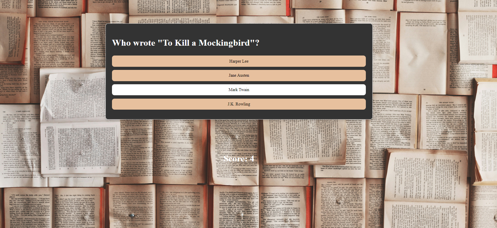

# Mindstorms

Mindstorms is a quiz application built with React. It features a main page with a start button, a set of 15 questions, and a results page that shows the user's score.

## Features

- **Start Page**: The entry point of the application with a start button to begin the quiz.
- **Quiz Page**: A series of 15 questions presented one by one.
- **Results Page**: Displays the user's score at the end of the quiz.

## Screenshots

### Start Page 
 
### Quiz Page 
 
 
### Results Page 

## Installation

To get a local copy up and running, follow these steps:

1. Clone the repository:
   git clone https://github.com/nehaannie/mindstorms.git

   Navigate to the project directory:

2.
Copy code
cd mindsrorms
Install the dependencies:

3.
Copy code
npm install
Start the development server:

4.
Copy code
npm start
Usage
Open your browser and navigate to http://localhost:3000.
Click the "Start" button to begin the quiz.
Answer the questions as they appear.
View your score on the results page.

## Contributing
Contributions are what make the open-source community such an amazing place to be, learn, and create. Any contributions you make are greatly appreciated.
Fork the Project
Create your Feature Branch (git checkout -b feature/AmazingFeature)
Commit your Changes (git commit -m 'Add some AmazingFeature')
Push to the Branch (git push origin feature/AmazingFeature)
Open a Pull Request

Contact
nehaannie2002@gmail.com

